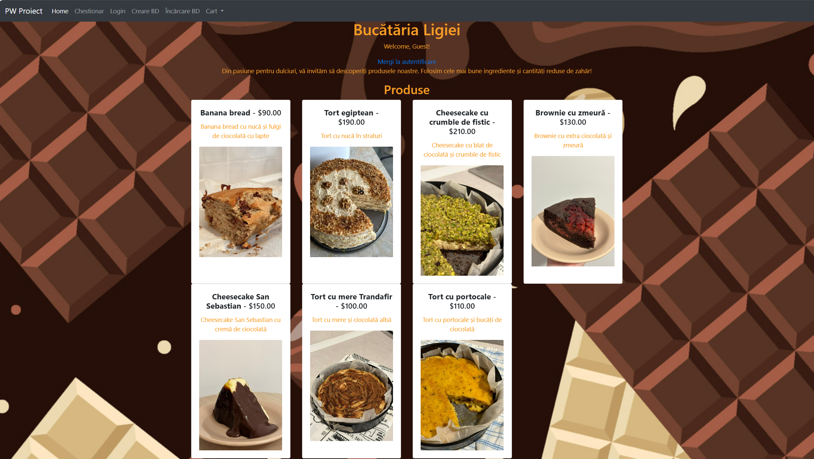

# Magazin-Online

Aplicația utilizează serverul web Node.js, framework-ul Express și MySQL pentru baza de date. Tematica constă într-un magazin online care permite accesul pe bază de rol:
- client: poate adăuga produse în coș
- admin: poate adăuga produse în baza de date.

## Structura Proiectului
```
Magazin-Online/
├── node_modules/                  # Conține pachetele necesare proiectului și este creat cu utilitarul npm
├── public/                        # Conține toate resursele accesibile direct de către client (e.g., fișiere css, javascript, imagini)
├── views/
|   ├── admin-page.ejs             # Pagina admin, în care se pot introduce produse noi
│   ├── autentificare.ejs          # Pagina de autentificare a utilizatorilor, include un formular de login
│   ├── chestionar.ejs             # Conține un chestionar sub formă de formular
│   ├── index.ejs                  # Pagina principală, include un link către pagina de autentificare
│   ├── layout.ejs                 # Conține template-ul principal al site-ului
│   ├── rezultat-chestionar.ejs    # Pagina de rezultate ale chestionarului, afișează numărul de răspunsuri selectate corect de către utilizator
│   └── vizualizare-cos.ejs        # Pagina de vizualizare a coșului de cumpărături
├── .gitignore                     
├── app.js                         # Scriptul principal al aplicației, configurează serverul și rutele
├── intrebari.json                 # Fișier JSON care conține întrebările pentru chestionar
├── package-lock.json              
└── package.json        
```           

## Pornirea serverului

Asigurați-vă că aveți Node.js instalat și utilizați comanda din interiorul folder-ului Magazin-Online:
```bash
   node app.js
```


## Funcționalități

- Autentificare cu drepturi diferite de acces(admin sau utilizator)
- Adăugare de produse în coș și vizualizarea lor în coșul de cumpărături (doar pentru utilizatorii autentificați)
- Completarea unui chestionar și vizualizarea rezultatelor
- Adăugarea de produse în baza de date (doar pentru admin)


